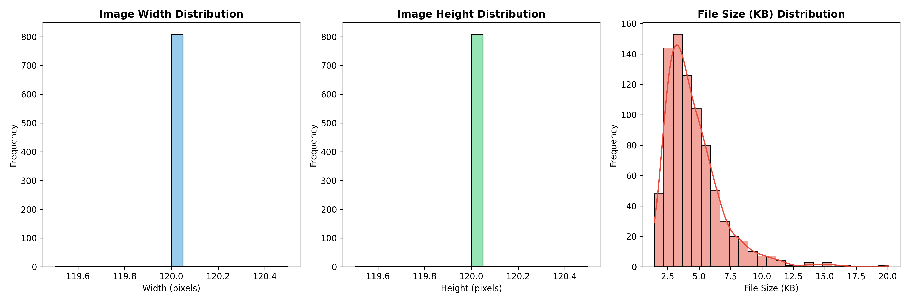
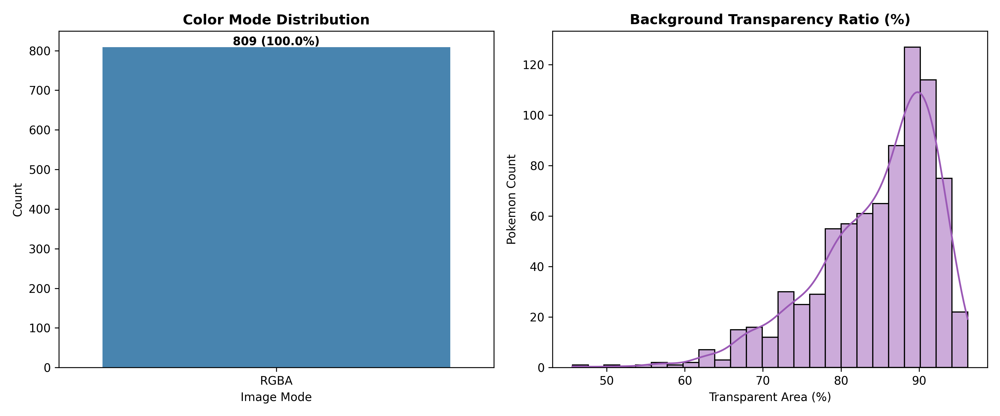

# Pokemon Images and Types - Exploratory Data Analysis (EDA) Report

## 1. Executive Summary

This report presents a comprehensive Exploratory Data Analysis (EDA) of the **Pokemon Images and Types** dataset (Kaggle: `vishalsubbiah/pokemon-images-and-types`). The dataset contains metadata and sprites for **809 Pokémon** across multiple generations.

### Key Highlights:
- **Total Samples**: 809 Pokémon with 100% matching sprite images.
- **Image Resolution**: Perfectly uniform **120 × 120 pixels** (1:1 Aspect Ratio) across all images.
- **Image Format & Mode**: 100% **PNG** with **RGBA** (4 channels: Red, Green, Blue, Alpha).
- **Background Transparency**: Average background transparency is **84.54%** (foreground Pokémon sprites occupy ~15.46% of the canvas).
- **Class Balance**: 
  - **Single Type**: 404 (49.94%)
  - **Dual Type**: 405 (50.06%)
  - Primary Type (`Type1`) is led by **Water (114)** and **Normal (105)**, while **Flying (3)** has the fewest primary entries.
  - Secondary Type (`Type2`) is heavily dominated by **Flying (95)**.

---

## 2. Dataset Overview & Tabular Metadata

### 2.1 Metadata Structure
The metadata table (`pokemon.csv`) consists of 4 attributes:

| Column | Non-Null Count | Null Count | Data Type | Description |
| :--- | :--- | :--- | :--- | :--- |
| `Name` | 809 | 0 | string | Pokémon name (matches image filename `{Name}.png`) |
| `Type1` | 809 | 0 | string | Primary elemental type (18 unique classes) |
| `Type2` | 405 | 404 | string | Secondary elemental type (18 unique classes, null if single type) |
| `Evolution` | 32 | 777 | string | Direct next evolution target name (where specified) |

### 2.2 Single vs. Dual Type Breakdown
Almost exactly half of the Pokémon in this dataset are dual-type Pokémon:


- **Single Type**: 404 (49.9%)
- **Dual Type**: 405 (50.1%)

---

## 3. Type Distribution Analysis

### 3.1 Primary (`Type1`) & Secondary (`Type2`) Distributions


#### Distribution Table (Primary vs Secondary):
| Type | Type 1 Count | Type 1 % | Type 2 Count | Type 2 % |
| :--- | :--- | :--- | :--- | :--- |
| **Water** | 114 | 14.09% | 17 | 4.20% |
| **Normal** | 105 | 12.98% | 4 | 0.99% |
| **Grass** | 78 | 9.64% | 19 | 4.69% |
| **Bug** | 72 | 8.90% | 5 | 1.23% |
| **Fire** | 53 | 6.55% | 11 | 2.72% |
| **Psychic** | 53 | 6.55% | 29 | 7.16% |
| **Rock** | 46 | 5.69% | 14 | 3.46% |
| **Electric** | 40 | 4.94% | 8 | 1.98% |
| **Poison** | 34 | 4.20% | 32 | 7.90% |
| **Ground** | 32 | 3.96% | 32 | 7.90% |
| **Dark** | 29 | 3.58% | 17 | 4.20% |
| **Fighting** | 29 | 3.58% | 25 | 6.17% |
| **Dragon** | 27 | 3.34% | 18 | 4.44% |
| **Ghost** | 27 | 3.34% | 16 | 3.95% |
| **Steel** | 26 | 3.21% | 23 | 5.68% |
| **Ice** | 23 | 2.84% | 11 | 2.72% |
| **Fairy** | 18 | 2.22% | 29 | 7.16% |
| **Flying** | 3 | 0.37% | 95 | 23.46% |

> [!NOTE]
> **Key Observation**: `Flying` is overwhelmingly used as a secondary type (`Type2` = 95), while only 3 Pokémon have `Flying` as their primary type (Tornadus, Noibat, Noivern). Conversely, `Normal` and `Water` are dominant primary types.

### 3.2 Type Co-occurrence Matrix
The co-occurrence heatmap illustrates how types are combined in dual-type Pokémon:


- **Most Frequent Pairings**:
  - `Normal` + `Flying` (24 Pokémon - classic regional birds)
  - `Bug` + `Poison` (12 Pokémon)
  - `Grass` + `Poison` (15 Pokémon)
  - `Bug` + `Flying` (14 Pokémon)
  - `Water` + `Ground` (10 Pokémon)

---

## 4. Image Characteristics Analysis



### 4.1 Resolution & Dimensions
- **Resolution**: Every image is **120 × 120 pixels**.
- **Aspect Ratio**: Constant **1.0** (Square).
- **Corrupted / Unreadable Images**: 0 (all 809 images are verified readable).

### 4.2 Color Modes & Alpha Transparency



- **Mode**: 100% of images are in **RGBA** mode (4 channels, 8-bit per channel).
- **Transparency Statistics**:
  - **Mean Transparent Canvas Area**: 84.54%
  - **Median**: 85.34%
  - **Min Transparent Area**: 45.61% (Large Pokémon like Wailord, Steelix)
  - **Max Transparent Area**: 96.23% (Small sprites like Diglett, Flabébé)
- **File Size**:
  - **Mean**: 4.53 KB
  - **Min**: 1.46 KB
  - **Max**: 20.04 KB
  - **Standard Deviation**: 2.12 KB

---

## 5. Color & Visual Profile by Type

To understand how visual characteristics correlate with type labels, the average RGB color values and perceived brightness of the foreground pixels (excluding transparent background) were analyzed:


### Findings:
1. **Fire Types**: High Red intensity ($R \approx 195, G \approx 115, B \approx 85$), producing distinctly warm/orange foreground palettes.
2. **Grass Types**: High Green intensity ($R \approx 120, G \approx 175, B \approx 90$), aligning with natural foliage tones.
3. **Water Types**: Strong Blue dominance ($R \approx 110, G \approx 145, B \approx 200$).
4. **Electric Types**: High Red & Green (Yellow) channels ($R \approx 205, G \approx 190, B \approx 95$).
5. **Ghost / Poison Types**: Rich Purple and Dark tones ($R \approx 140, G \approx 105, B \approx 160$).
6. **Ice Types**: Highest overall perceived brightness due to cyan/white palettes.

### 5.1 Sample Gallery


---

## 6. Recommendations for Computer Vision & Modeling

Based on the findings from this EDA, the following pipeline recommendations are advised:

### 1. Alpha Channel Handling
- **Issue**: Standard pre-trained backbones (ResNet, EfficientNet, ViT) expect 3-channel (RGB) images with standard backgrounds.
- **Recommendation**: Convert RGBA to RGB by compositing the transparent background over a uniform white or neutral background:
  ```python
  def rgba_to_rgb(img, bg_color=(255, 255, 255)):
      if img.mode == 'RGBA':
          background = Image.new('RGB', img.size, bg_color)
          background.paste(img, mask=img.split()[3])
          return background
      return img.convert('RGB')
  ```

### 2. Multi-Label vs Multi-Class Target
- Over 50% of instances are dual-type.
- If modeling Pokemon Type classification:
  - **Option A (Recommended)**: Formulate as a **Multi-Label Classification** problem with Binary Cross-Entropy loss ($\text{BCEWithLogitsLoss}$), where each Pokemon can have 1 or 2 active labels out of 18 classes.
  - **Option B**: Predict `Type1` (18 classes) and optionally `Type2` with an auxiliary head or hierarchical classification.

### 3. Class Imbalance Handling
- Severe class imbalance exists (e.g., `Flying` primary has 3 samples vs `Water` with 114 samples).
- **Techniques**:
  - Apply **Focal Loss** or **Class-Weighted Cross-Entropy / BCE**.
  - Use stratified splitting or iterative multi-label stratified split (e.g., `iterative-stratification`).

### 4. Data Augmentation
- Given the dataset size (809 images), data augmentation is essential to prevent overfitting:
  - Random Horizontal Flip ($p=0.5$)
  - Mild Random Rotation ($\pm 15^\circ$)
  - Random Affine Scaling ($0.9 - 1.1$)
  - Random Color Jitter (Brightness $\pm 0.1$, Contrast $\pm 0.1$, Saturation $\pm 0.1$)
  - Random Background Color Substitution (Synthetic backgrounds to ensure model learns sprite features rather than background artifacts)

---

## 7. How to Reproduce EDA
Run the following script from the root directory:
```bash
python src/eda.py
```
This will:
1. Process all 809 Pokémon images and metadata.
2. Output extracted features to [`reports/eda_summary.csv`](file:///c:/Users/Newsk/Downloads/pokemon/reports/eda_summary.csv).
3. Generate all figures in [`reports/figures/`](file:///c:/Users/Newsk/Downloads/pokemon/reports/figures/).
