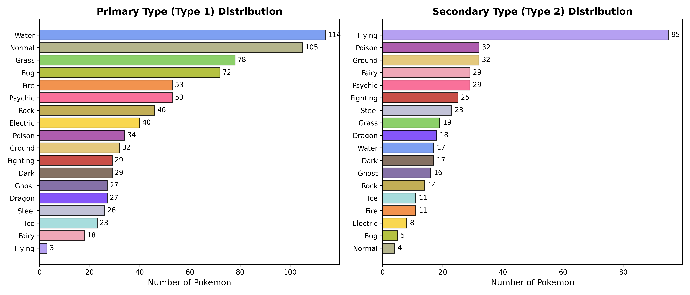
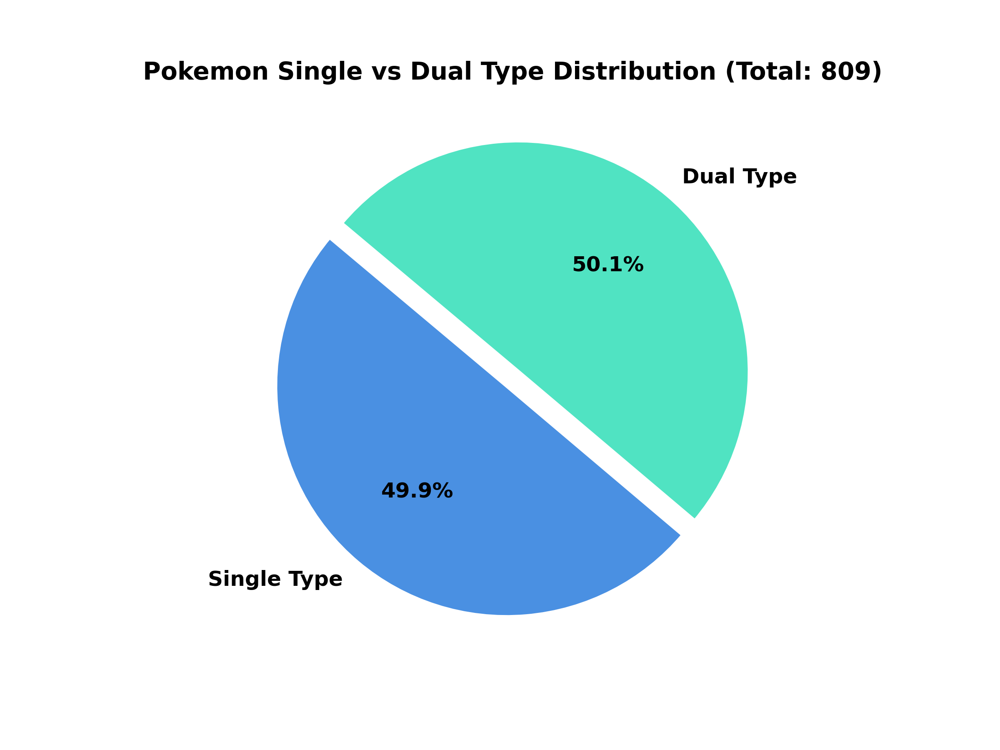
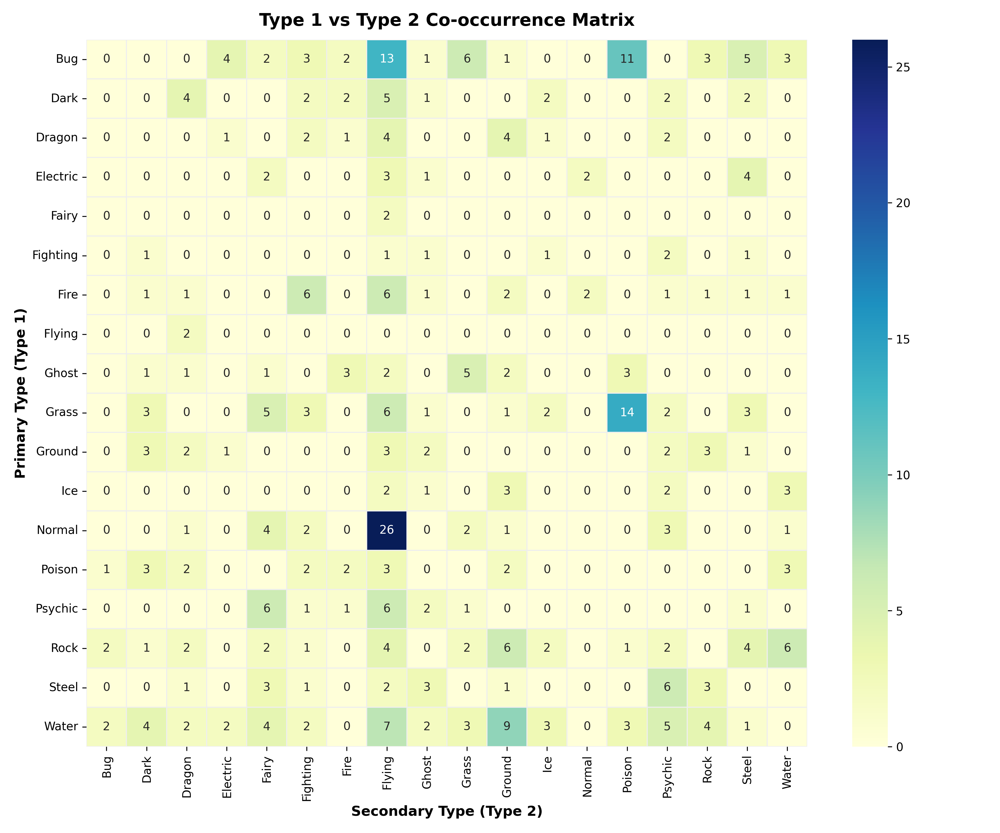
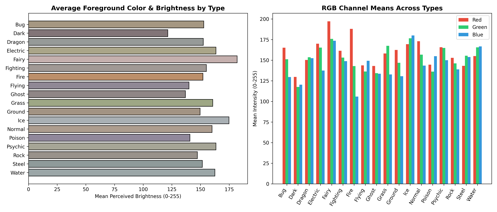
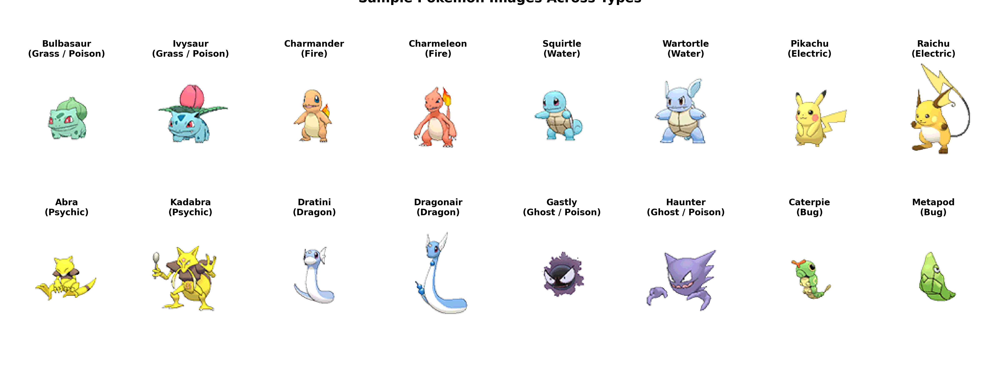

<div align="center">

# ⚡ Pokemon Image Processing & Classification Pipeline

[](https://www.python.org/)
[](https://pytorch.org/)
[](https://www.kaggle.com/datasets/vishalsubbiah/pokemon-images-and-types)
[](https://github.com/psf/black)
[](https://github.com/PichyyyNews/pokemon-imgaeprocessing)

An end-to-end Computer Vision and Image Processing pipeline for the **Pokemon Images and Types** dataset. Features comprehensive Exploratory Data Analysis (EDA), RGBA alpha-transparency compositing, multi-hot label engineering, stratified dataset splitting, dynamic data augmentation, and PyTorch DataLoader integration.

[📊 EDA Report](EDA_REPORT.md) • [⚙️ Preprocessing Report](PREPROCESSING_REPORT.md) • [🚀 Quick Start](#-quick-start) • [📁 Project Structure](#-project-structure)

---

</div>

## 📖 Table of Contents
- [📌 Project Overview](#-project-overview)
- [🗂️ Dataset Summary](#️-dataset-summary)
- [📊 Exploratory Data Analysis (EDA)](#-exploratory-data-analysis-eda)
  - [Type Distribution & Co-occurrence](#type-distribution--co-occurrence)
  - [Color Profile & Visual Features](#color-profile--visual-features)
- [⚙️ Preprocessing & Augmentation Pipeline](#️-preprocessing--augmentation-pipeline)
  - [Alpha Channel Compositing](#alpha-channel-compositing)
  - [Data Augmentation Showcase](#data-augmentation-showcase)
  - [Stratified Dataset Splits](#stratified-dataset-splits)
- [📁 Project Structure](#-project-structure)
- [🚀 Quick Start](#-quick-start)
- [💻 PyTorch Integration](#-pytorch-integration)
- [🌿 Branch & Git Flow Strategy](#-branch--git-flow-strategy)

---

## 📌 Project Overview

This repository provides a modular, production-ready image processing foundation for multi-label Pokémon type classification:

```mermaid
graph LR
    A[Kaggle Dataset<br/>809 RGBA Sprites] --> B[Data Ingestion<br/>data_loader.py]
    B --> C[Exploratory Data Analysis<br/>eda.py]
    C --> D[Data Cleaning & Compositing<br/>preprocessing.py]
    D --> E[Stratified Splitting<br/>Train: 70% | Val: 15% | Test: 15%]
    E --> F[Augmentation Pipeline<br/>Crop, Flip, Rotate, Jitter, BG]
    F --> G[PyTorch DataLoaders<br/>Ready for Deep Learning Models]
```

---

## 🗂️ Dataset Summary

- **Source**: [Kaggle: Pokemon Images and Types](https://www.kaggle.com/datasets/vishalsubbiah/pokemon-images-and-types) by Vishal Subbiah
- **Total Samples**: 809 Pokémon across multiple generations
- **Attributes**: `Name`, `Type1` (Primary Type), `Type2` (Secondary Type), `Evolution`

| Feature | Specification | Description |
| :--- | :--- | :--- |
| **Image Resolution** | `120 × 120` | 100% uniform square resolution across all sprites |
| **Color Mode** | `RGBA` (4 channels) | 8-bit Red, Green, Blue + Alpha transparency channel |
| **Mean Transparency** | `84.54%` | Sprite occupies ~15.46% of the 120x120 canvas on average |
| **Type Breakdown** | 18 Types | 404 Single-Type (49.9%) vs 405 Dual-Type (50.1%) |

> [!NOTE]
> Dataset files (`data/`) are kept locally and untracked in Git via `.gitignore` to keep the repository lightweight. Use `python src/data_loader.py` to automatically download and sync the dataset.

---

## 📊 Exploratory Data Analysis (EDA)

> 📑 **Read the detailed report**: [EDA_REPORT.md](EDA_REPORT.md)

### Type Distribution & Co-occurrence

<p align="center">
  
  
</p>

<p align="center">
  
</p>

- **Primary Types**: Dominated by **Water (114)**, **Normal (105)**, **Grass (78)**, and **Bug (72)**. **Flying** has only 3 primary entries.
- **Secondary Types**: Heavily dominated by **Flying (95)**, followed by **Poison (32)**, **Ground (32)**, and **Psychic (29)**.
- **Single vs Dual**: Almost a 50/50 split (404 single-type vs 405 dual-type).

### Color Profile & Visual Features

<p align="center">
  
</p>

<p align="center">
  
</p>

- Distinct RGB signatures match elemental classes: **Fire** (high Red/Orange), **Grass** (high Green), **Water** (high Blue), **Electric** (high Yellow/Brightness), **Poison/Ghost** (Dark Purple).

---

## ⚙️ Preprocessing & Augmentation Pipeline

> 📑 **Read the detailed report**: [PREPROCESSING_REPORT.md](PREPROCESSING_REPORT.md)

### Alpha Channel Compositing
Standard vision backbones expect 3-channel RGB images. The pipeline cleanly composites the alpha mask onto solid backgrounds:
- **Inference & Evaluation**: Clean white background `(255, 255, 255)`.
- **Training**: Dynamically randomized light backgrounds `(RGB: 180-255)` to prevent background memorization.

<p align="center">
  
</p>

### Data Augmentation Showcase
To prevent overfitting on 565 training images, dynamic photometric and geometric augmentations are applied:

<p align="center">
  
</p>

### Stratified Dataset Splits
A 2-stage stratified split was performed with seed `42` preserving rare class distributions:

| Split | Samples | Percentage | Target Output CSV |
| :--- | :---: | :---: | :--- |
| **Train Set** | **565** | 69.84% | [`reports/splits/train.csv`](reports/splits/train.csv) |
| **Validation Set** | **122** | 15.08% | [`reports/splits/val.csv`](reports/splits/val.csv) |
| **Test Set** | **122** | 15.08% | [`reports/splits/test.csv`](reports/splits/test.csv) |
| **Total** | **809** | 100.0% | [`reports/splits/splits_summary.json`](reports/splits/splits_summary.json) |

---

## 📁 Project Structure

```text
pokemon-imgaeprocessing/
├── .gitignore                      # Git ignore rules (ignores data/ and cache)
├── EDA_REPORT.md                   # Full Exploratory Data Analysis report
├── PREPROCESSING_REPORT.md         # Full Preprocessing & Augmentation report
├── README.md                       # Main repository overview and documentation
├── requirements.txt                # Python package dependencies
├── reports/
│   ├── eda_report.md               # EDA report archive
│   ├── eda_summary.csv             # Extracted image features (809 records)
│   ├── preprocessing_report.md     # Preprocessing report archive
│   ├── figures/                    # Generated high-resolution charts & figures
│   │   ├── 01_type_distribution.png
│   │   ├── 02_single_vs_dual_type.png
│   │   ├── 03_type_co_occurrence_heatmap.png
│   │   ├── 04_image_dimensions_and_filesize.png
│   │   ├── 05_color_mode_and_transparency.png
│   │   ├── 06_average_color_by_type.png
│   │   ├── 07_pokemon_sample_gallery.png
│   │   ├── 08_preprocessing_compositing.png
│   │   └── 09_augmentation_showcase.png
│   └── splits/                     # Stratified dataset split CSVs
│       ├── splits_summary.json
│       ├── test.csv
│       ├── train.csv
│       └── val.csv
└── src/
    ├── __init__.py
    ├── data_loader.py              # Kagglehub dataset download & loader
    ├── eda.py                      # Exploratory Data Analysis & visualizer
    └── preprocessing.py            # Preprocessing, Augmentation & PyTorch Dataset
```

---

## 🚀 Quick Start

### 1. Clone & Install Dependencies
```bash
git clone https://github.com/PichyyyNews/pokemon-imgaeprocessing.git
cd pokemon-imgaeprocessing
pip install -r requirements.txt
```

### 2. Download Dataset
```bash
python src/data_loader.py
```

### 3. Run EDA Pipeline & Generate Charts
```bash
python src/eda.py
```

### 4. Run Preprocessing, Augmentations & Splits
```bash
python src/preprocessing.py
```

---

## 💻 PyTorch Integration

Use [`src/preprocessing.py`](src/preprocessing.py) to directly obtain PyTorch `DataLoader` batches for model training:

```python
from src.preprocessing import get_dataloaders

# Load Train, Validation, and Test DataLoaders
train_loader, val_loader, test_loader = get_dataloaders(
    batch_size=32,
    image_size=120,          # Standard sprite size (or 224 for ResNet/ViT)
    target_type="multilabel" # Multi-hot 18-dim vector (or "type1" for single-class)
)

# Training loop integration
for batch_idx, (images, targets, metadata) in enumerate(train_loader):
    # images:  torch.Tensor of shape [32, 3, 120, 120] (ImageNet normalized)
    # targets: torch.Tensor of shape [32, 18] (Multi-hot binary vector)
    
    outputs = model(images)
    loss = criterion(outputs, targets)
    loss.backward()
    optimizer.step()
    break
```

---

## 🌿 Branch & Git Flow Strategy

| Branch Name | Status | Description |
| :--- | :---: | :--- |
| **`main`** | 🟢 Production | Stable releases, combined reports, merged code |
| **`feat/datacollection`** | 🟡 Completed | Dataset ingestion via `kagglehub` and data structure |
| **`feat/eda`** | 🟡 Completed | Image & tabular Exploratory Data Analysis + Visualizations |
| **`feat/datapreprocessing`** | 🟡 Completed | Cleaning, alpha compositing, augmentations, splits, PyTorch Dataset |

---

<div align="center">
  <sub>Built with ❤️ by <b>PichyyyNews</b> for Pokemon Image Processing & Deep Learning.</sub>
</div>
