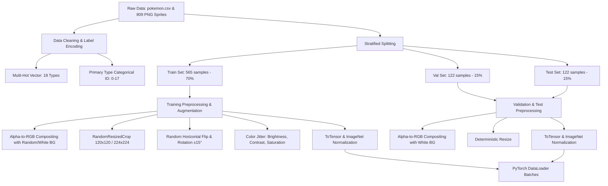
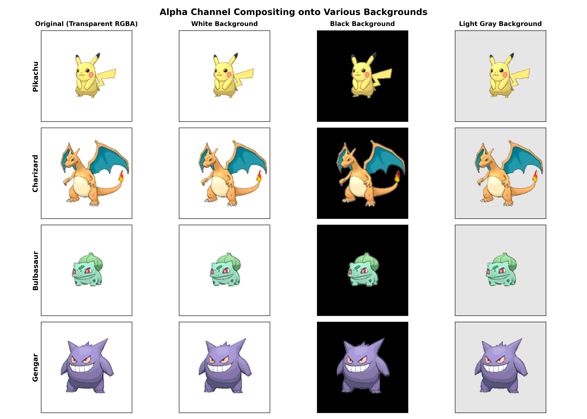
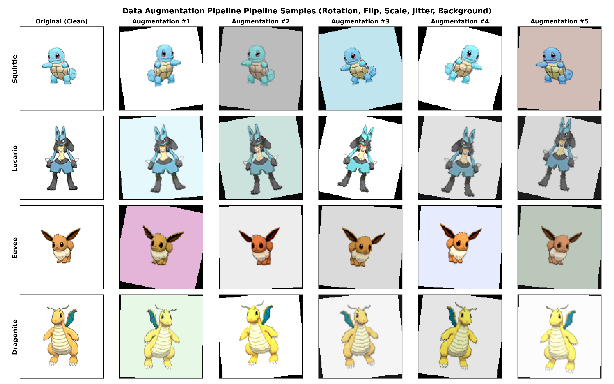

# Pokemon Images & Types - Data Preprocessing & Augmentation Pipeline Report

## 1. Pipeline Architecture Overview

This report details the end-to-end data cleaning, preprocessing, stratified splitting, and augmentation pipeline designed for the **Pokemon Images and Types** dataset. The pipeline prepares the raw RGBA sprite images and tabular type labels into ready-to-train PyTorch `Dataset` and `DataLoader` batches suitable for computer vision classification and multi-label recognition tasks.



---

## 2. Data Cleaning & Label Engineering

### 2.1 18 Elemental Pokemon Types Vocabulary
All 18 canonical Pokemon types are mapped deterministically in alphabetical order:

| Index | Type | Index | Type | Index | Type |
| :---: | :--- | :---: | :--- | :---: | :--- |
| **0** | Bug | **6** | Fire | **12** | Normal |
| **1** | Dark | **7** | Flying | **13** | Poison |
| **2** | Dragon | **8** | Ghost | **14** | Psychic |
| **3** | Electric | **9** | Grass | **15** | Rock |
| **4** | Fairy | **10** | Ground | **16** | Steel |
| **5** | Fighting | **11** | Ice | **17** | Water |

### 2.2 Encoding Strategies
1. **Multi-Hot Encoding (`target_type="multilabel"`)**:
   - Generates an 18-dimensional vector $\mathbf{y} \in \{0, 1\}^{18}$.
   - For single-type Pokémon (e.g. *Pikachu* $\rightarrow$ Electric): index `3` is $1.0$, all others $0.0$.
   - For dual-type Pokémon (e.g. *Charizard* $\rightarrow$ Fire / Flying): indices `6` and `7` are $1.0$, all others $0.0$.
   - **Loss Function**: `torch.nn.BCEWithLogitsLoss()`.

2. **Single-Class Index (`target_type="type1"`)**:
   - Generates a scalar integer $y \in [0, 17]$ for the primary elemental type (`Type1`).
   - **Loss Function**: `torch.nn.CrossEntropyLoss()`.

---

## 3. Image Preprocessing & Alpha Channel Handling

### 3.1 RGBA Compositing
All 809 Pokémon images in this dataset are 4-channel PNGs with transparent alpha backgrounds (~84.5% transparency). Pre-trained vision backbones (e.g., ResNet, EfficientNet, ConvNeXt, ViT) require standard 3-channel RGB tensors.

Our `composite_rgba_to_rgb` function cleanly pastes the foreground sprite using its alpha mask onto solid backgrounds:
- **Evaluation / Production**: Clean white background `(255, 255, 255)` or neutral background.
- **Training**: Dynamically injects randomized light background colors `(RGB: 180-255)` to ensure the network learns the morphology of the Pokémon rather than memorizing a pure white background.



---

## 4. Stratified Dataset Splitting

To prevent data leakage and guarantee proportional representation across rare classes (e.g. `Flying` primary type with only 3 samples), a 2-stage stratified split was performed with seed `42`:

### 4.1 Split Distribution
| Dataset Split | Sample Count | Percentage | Saved File Path |
| :--- | :---: | :---: | :--- |
| **Train Set** | **565** | 69.84% | [`reports/splits/train.csv`](reports/splits/train.csv) |
| **Validation Set** | **122** | 15.08% | [`reports/splits/val.csv`](reports/splits/val.csv) |
| **Test Set** | **122** | 15.08% | [`reports/splits/test.csv`](reports/splits/test.csv) |
| **Total** | **809** | 100.0% | [`reports/splits/splits_summary.json`](reports/splits/splits_summary.json) |

---

## 5. Data Augmentation Pipeline

Given the compact dataset size (565 training images), an augmentation pipeline is applied during training to prevent overfitting and enhance generalization.

### 5.1 Augmentation Techniques Applied
| Transform | Hyperparameters | Purpose |
| :--- | :--- | :--- |
| **Random Background Compositing** | $p=0.4$, RGB: $180-255$ | Prevents background color overfitting |
| **Random Resized Crop** | Scale: $(0.85, 1.0)$, Ratio: $(0.9, 1.1)$ | Invariance to scale and slight position shifts |
| **Random Horizontal Flip** | $p=0.5$ | Left-right orientation symmetry |
| **Random Rotation** | Degrees: $\pm 15^\circ$ | Rotational tolerance |
| **Color Jitter** | Brightness $\pm 0.15$, Contrast $\pm 0.15$, Saturation $\pm 0.15$, Hue $\pm 0.04$ | Lighting variation robustness without altering primary elemental color cues |
| **ImageNet Normalization** | $\mu=[0.485, 0.456, 0.406], \sigma=[0.229, 0.224, 0.225]$ | Matches pre-trained transfer learning weights |

### 5.2 Visual Augmentation Showcase
Below is a demonstration of 5 distinct augmented variations generated dynamically for sample Pokémon:



---

## 6. PyTorch Dataset & DataLoader API

The module [`src/preprocessing.py`](../src/preprocessing.py) provides a high-level API for model training:

```python
from src.preprocessing import get_dataloaders

# Create PyTorch DataLoaders
train_loader, val_loader, test_loader = get_dataloaders(
    batch_size=32,
    image_size=120,          # or 224 for ImageNet pre-trained models
    target_type="multilabel" # or "type1"
)

# Example training loop step
for images, targets, metadata in train_loader:
    # images shape:  torch.Size([32, 3, 120, 120])
    # targets shape: torch.Size([32, 18])
    outputs = model(images)
    loss = criterion(outputs, targets)
    loss.backward()
    optimizer.step()
```

---

## 7. How to Run the Pipeline

To re-run the preprocessing pipeline, generate split CSV files, and export visual figures:
```bash
python src/preprocessing.py
```

### Generated Artifacts:
- 📁 **Splits**: [`reports/splits/train.csv`](reports/splits/train.csv), [`reports/splits/val.csv`](reports/splits/val.csv), [`reports/splits/test.csv`](reports/splits/test.csv)
- 📊 **Metadata JSON**: [`reports/splits/splits_summary.json`](reports/splits/splits_summary.json)
- 🖼️ **Visualizations**: [`reports/figures/08_preprocessing_compositing.png`](reports/figures/08_preprocessing_compositing.png), [`reports/figures/09_augmentation_showcase.png`](reports/figures/09_augmentation_showcase.png)
